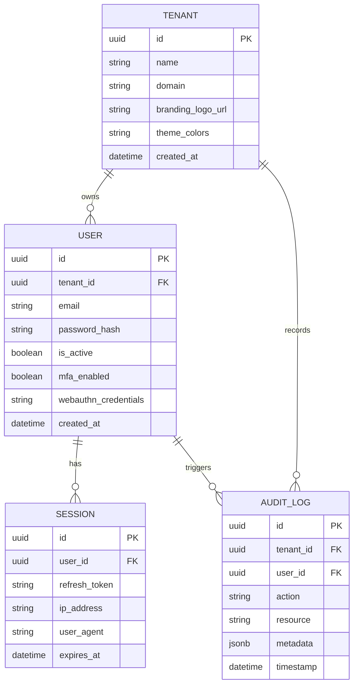
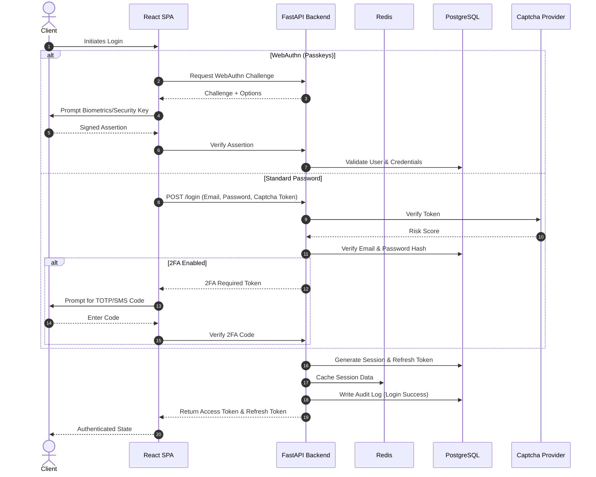

# 🏛️ Architecture Overview

This document provides a high-level overview of the OmniAuth Service architecture, highlighting our database schema design and the flow of critical authentication requests.

---

## Database Schema

Our database is designed around a multi-tenant model. Every entity is tenant-aware, ensuring strict data isolation across different organizations using the service.

### Key Entities

- **TENANT**: Represents an organization or isolated instance within the Auth Service.
- **USER**: The individuals authenticating against a tenant. Includes support for traditional passwords and Passkeys (WebAuthn).
- **SESSION**: Tracks active user sessions, storing refresh tokens and client metadata for anomaly detection.
- **AUDIT_LOG**: Immutable ledger of all security events and administrative actions for compliance and monitoring.

---

## Authentication Flows

### Login Request Flow (with 2FA / Passkeys)

The authentication process seamlessly supports Password + 2FA or passwordless WebAuthn (Passkeys) while evaluating bot risks via Captcha.

### Flow Breakdown

1. **Initialization**: The client application begins the login process.
2. **Path Selection**: Based on the user's setup and preference, the flow branches to either WebAuthn or Password-based login.
3. **WebAuthn**: 
   - A cryptographic challenge is issued.
   - The user signs the challenge with their device authenticator (Passkey).
   - The backend verifies the signature against the public key stored in the database.
4. **Standard Password + 2FA**:
   - The initial request is vetted by the Captcha provider to block bot traffic.
   - Credentials are verified.
   - If MFA is enabled, an intermediate token is issued, and the user must provide a TOTP or SMS code to finalize the login.
5. **Session Finalization**: Upon successful verification, tokens are issued, caching is updated for fast authorization, and an audit log is recorded for security monitoring.
