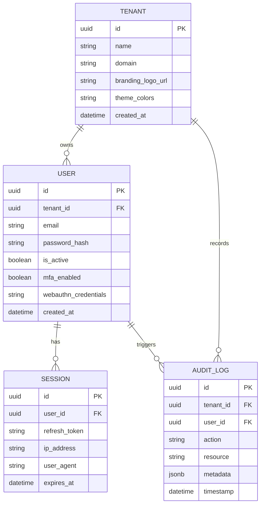
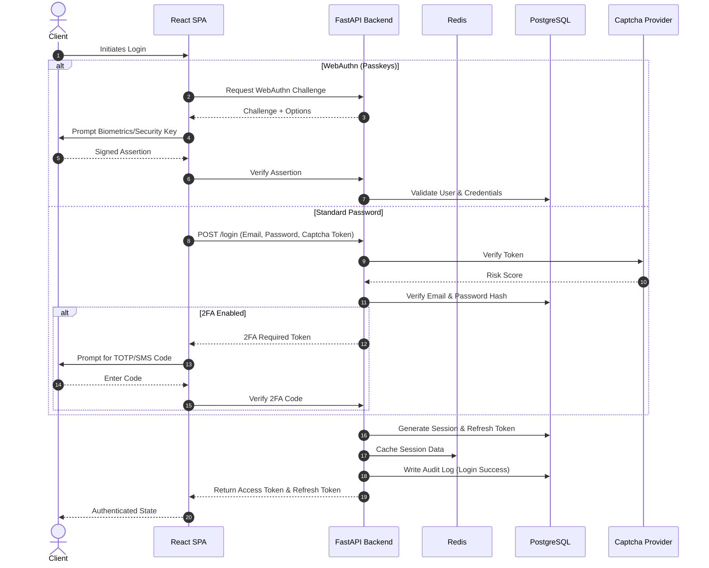

# 🏛️ Architecture Overview / Обзор Архитектуры

[🇺🇸 English Version](#-english-version) | [🇷🇺 Русская Версия](#-русская-версия)

---

## 🇺🇸 English Version

This document provides a high-level overview of the OmniAuth Service architecture, highlighting our database schema design and the flow of critical authentication requests.

### Database Schema

Our database is designed around a multi-tenant model. Every entity is tenant-aware, ensuring strict data isolation across different organizations using the service.

#### Key Entities
- **TENANT**: Represents an organization or isolated instance within the Auth Service.
- **USER**: The individuals authenticating against a tenant. Includes support for traditional passwords and Passkeys (WebAuthn).
- **SESSION**: Tracks active user sessions, storing refresh tokens and client metadata for anomaly detection.
- **AUDIT_LOG**: Immutable ledger of all security events and administrative actions for compliance and monitoring.

### Authentication Flows

#### Login Request Flow (with 2FA / Passkeys)

The authentication process seamlessly supports Password + 2FA or passwordless WebAuthn (Passkeys) while evaluating bot risks via Captcha.

#### Flow Breakdown
1. **Initialization**: The client application begins the login process.
2. **Path Selection**: Based on the user's setup and preference, the flow branches to either WebAuthn or Password-based login.
3. **WebAuthn**: 
   - A cryptographic challenge is issued.
   - The user signs the challenge with their device authenticator (Passkey).
   - The backend verifies the signature against the public key stored in the database.
4. **Standard Password + 2FA**:
   - The initial request is vetted by the Captcha provider to block bot traffic.
   - Credentials are verified.
   - If MFA is enabled, an intermediate token is issued, and the user must provide a TOTP or SMS code to finalize the login.
5. **Session Finalization**: Upon successful verification, tokens are issued, caching is updated for fast authorization, and an audit log is recorded for security monitoring.

---

## 🇷🇺 Русская Версия

Этот документ представляет собой высокоуровневый обзор архитектуры сервиса OmniAuth, описывающий структуру базы данных и потоки выполнения ключевых запросов аутентификации.

### Схема базы данных

Наша база данных спроектирована на основе мультитенантной модели. Каждая сущность привязана к тенанту (арендатору), что гарантирует строгую изоляцию данных между различными организациями, использующими сервис.

*(Диаграмму сущностей смотрите в английской версии выше)*

#### Ключевые сущности
- **TENANT (Тенант)**: Представляет организацию или изолированный экземпляр внутри сервиса аутентификации.
- **USER (Пользователь)**: Лица, проходящие аутентификацию в рамках тенанта. Поддерживаются традиционные пароли и Passkeys (WebAuthn).
- **SESSION (Сессия)**: Отслеживает активные сессии пользователей, хранит refresh токены и метаданные клиента для обнаружения аномалий.
- **AUDIT_LOG (Аудит лог)**: Неизменяемый реестр всех событий безопасности и административных действий для соответствия требованиям и мониторинга.

### Потоки аутентификации

#### Процесс авторизации (с 2FA / Passkeys)

Процесс аутентификации бесшовно поддерживает связку Пароль + 2FA или беспарольный вход WebAuthn (Passkeys), одновременно оценивая риски активности ботов с помощью Captcha.

*(Sequence-диаграмму авторизации смотрите в английской версии выше)*

#### Разбор процесса
1. **Инициализация**: Клиентское приложение начинает процесс входа в систему.
2. **Выбор пути**: В зависимости от настроек и предпочтений пользователя, процесс разветвляется на вход по WebAuthn или с использованием пароля.
3. **WebAuthn**: 
   - Выдается криптографический challenge (вызов).
   - Пользователь подписывает challenge с помощью аутентификатора своего устройства (Passkey).
   - Бэкенд проверяет подпись по открытому ключу, хранящемуся в базе данных.
4. **Стандартный пароль + 2FA**:
   - Первоначальный запрос проверяется провайдером Captcha для блокировки ботов.
   - Проверяются учетные данные.
   - Если включена многофакторная аутентификация (MFA), выдается промежуточный токен, и для завершения входа пользователь должен предоставить код TOTP или SMS.
5. **Завершение сессии**: После успешной проверки выдаются токены доступа, обновляется кэш для быстрой авторизации в дальнейшем, а в лог аудита записывается событие для мониторинга безопасности.
