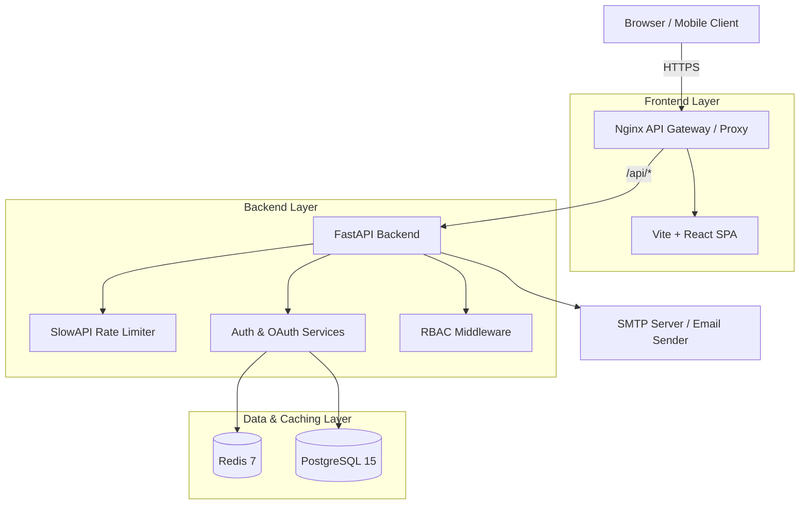

# 🛡️ Enterprise Auth Service
*🇺🇸 English version | [🇷🇺 Русская версия](README.ru.md)*


**Enterprise Auth Service** is a modern, highly scalable, and fully secure authentication and authorization system built with Clean Architecture principles. This project provides a production-ready Identity Provider (IdP) supporting the latest security standards: WebAuthn (Passkeys), OAuth 2.0 (Social Logins), 2FA/MFA (TOTP), JWT-based session management, Multi-Tenancy for B2B SaaS, and a built-in admin dashboard.

---

## 📑 Table of Contents
1. [Key Features](#1-key-features)
2. [Service Architecture](#2-service-architecture)
3. [Technology Stack](#3-technology-stack)
4. [Installation Guide (Quick Start)](#4-installation-guide-quick-start)
5. [Project Structure & Clean Architecture](#5-project-structure--clean-architecture)
6. [Detailed Module Descriptions](#6-detailed-module-descriptions)
7. [Deployment (Production)](#7-deployment-production)

---

## 1. Key Features

### 🔒 Security and Authentication
* **WebAuthn / Passkeys:** Passwordless login via biometrics (FaceID, TouchID, Windows Hello, YubiKey).
* **OAuth 2.0:** Instant login via Discord, Apple, Facebook, Twitter, Amazon, Google, GitHub.
* **Two-Factor Authentication (2FA/MFA):** Mandatory verification via Google Authenticator / Authy (TOTP codes).
* **Advanced Cryptography:** Passwords are mathematically secured using the state-of-the-art **Argon2** algorithm (resistant to GPU cracking).
* **JWT & Refresh Tokens:** High-performance session management. Refresh tokens are stored in secure HttpOnly cookies (XSS protection).
* **Email Verification & Password Reset:** Full account recovery flow via SMTP with temporary JWT tokens.
* **Rate Limiting & Anti-Bruteforce:** Built-in DDoS and password bruteforce protection based on SlowAPI.
* **RBAC (Role-Based Access Control):** Hierarchical role system (User, Moderator, Admin) and strict permission checking.

### 🏢 B2B Multi-Tenancy Ready
* **Isolated Data:** The architecture fundamentally supports tenant separation. Every repository inherits from `TenantScopedRepository`.
* **Context Resolution:** The API automatically resolves the correct `tenant_id` context via API Keys, JWTs, or Headers.

### 🎨 Premium Interface (UI/UX)
* **Glassmorphism Design:** Ultramodern interface with frosted glass effects and dynamic gradients.
* **Framer Motion:** Smooth appearance animations, page transitions, and interactive hover effects.
* **Toast Notification System:** Global animated pop-ups for errors and success messages.

---

## 2. Service Architecture



1. **API Gateway (Nginx):** Serves React static files and proxies `/api/*` requests to the backend, seamlessly solving CORS issues in production.
2. **FastAPI (Backend):** Core business logic. Processes requests asynchronously, generates tokens, and communicates with DB and Redis.
3. **Redis:** Stores temporary `state` keys for OAuth (CSRF protection) and challenge strings for WebAuthn.
4. **PostgreSQL:** Reliable relational storage for users, password hashes (Argon2), and user sessions.

---

## 3. Technology Stack

### Backend
- **Python 3.12** + **FastAPI**: Incredibly fast modern asynchronous framework.
- **SQLAlchemy (Async)** + **Alembic**: Advanced ORM for database management and migrations.
- **Pydantic V2**: Lightning-fast input data validation.
- **WebAuthn**: Comprehensive biometric authorization library.
- **PyJWT & Argon2-cffi**: Enterprise-grade hashing and stateless tokens.
- **SlowAPI**: Rate limiting and endpoint throttling.

### Frontend
- **React 18** + **Vite**: Ultra-fast build and Hot-Module Replacement (HMR).
- **TypeScript**: Strict typing across the entire codebase to eliminate runtime errors.
- **TailwindCSS** + **Framer Motion**: Rapid styling and beautiful physics-based animations.
- **Recharts**: Interactive data visualizations for the admin panel.
- **SimpleWebAuthn**: Direct communication with hardware keys from the browser.

---

## 4. Installation Guide (Quick Start)

You only need **Docker** and **Docker Compose** for local setup. No manual environment configuration is required.

### Step 1: Clone and Configure
```bash
git clone https://github.com/PashKa-tech/auth-service.git
cd auth-service
```

### Step 2: Environment Variables
Copy the example configuration to your local working environment:
```bash
cp backend/.env.example backend/.env
cp frontend/.env.local frontend/.env
```
In `backend/.env`, you can specify keys for OAuth providers (Discord, Apple, Google, etc.) and configure your SMTP server for sending verification emails.

### Step 3: Launch via Makefile
If you have `make` installed, simply type:
```bash
make up
```
Alternatively, use Docker Compose directly:
```bash
docker-compose up -d --build
```

### Step 4: Run Database Migrations
To create tables in your fresh database, run:
```bash
make migrate
# or: docker-compose exec backend alembic upgrade head
```

### Step 5: Usage
- **Frontend (UI):** Open `http://localhost`
- **Backend API Docs:** Open `http://localhost:8000/docs` (Interactive Swagger UI)

---

## 5. Project Structure & Clean Architecture

This project strictly follows the **Repository/Service** pattern to decouple business logic from data access.

```text
auth-service/
├── .github/workflows/    # CI/CD pipelines (Automated tests & Linting)
├── backend/              # FastAPI Application
│   ├── alembic/          # Database migrations
│   ├── src/
│   │   ├── api/          # Delivery Layer: Routes and Endpoints
│   │   ├── core/         # Core config: RBAC, Exceptions, Security, Context
│   │   ├── models/       # Data Layer: SQLAlchemy DB schemas
│   │   ├── repositories/ # Persistence Layer: Data access logic (CRUD)
│   │   ├── services/     # Business Layer: Core logic (Auth, Email, WebAuthn)
│   │   └── templates/    # Presentation: Jinja2 HTML email templates
│   ├── Dockerfile        # Backend containerization
│   └── main.py           # Application Factory, Middleware, SlowAPI
├── frontend/             # React SPA Application
│   ├── src/
│   │   ├── components/   # Reusable UI components (Toasts, Layout, Forms)
│   │   ├── pages/        # Views/Screens (Login, Profile, Admin)
│   │   └── services/     # External API Client (Axios wrappers)
│   ├── index.css         # Global styles (Tailwind + Glassmorphism variables)
│   ├── Dockerfile        # Frontend containerization (Multi-stage build)
│   └── nginx.conf        # Production web server configuration
├── docker-compose.yml    # Container orchestration
└── Makefile              # Handy automation commands for developers
```

---

## 6. Detailed Module Descriptions

### 🔑 Advanced OAuth 2.0
The OAuth module (in `services/oauth.py`) is built with extensibility in mind. It supports:
- **PKCE & State Validation**: Prevents CSRF attacks and code interception. The `state` key is securely saved in Redis.
- **Dynamic Redirect URIs**: Routing automatically determines the base domain, ensuring callbacks always return to the correct origin.

### 🛡️ WebAuthn (Passkeys)
The passwordless future is here. The flow is split into a highly secure two-stage process:
1. **Challenge:** `GET /begin` — The server generates a random cryptographic `challenge` and caches it in Redis.
2. **Attestation/Assertion:** The client-side `SimpleWebAuthn` signs the challenge with the device's private key (e.g., TouchID).
3. **Verification:** `POST /complete` — The server verifies the signature against the registered public key and issues a JWT token upon success.

### ✉️ Email Verification and Password Reset
Utilizes asynchronous `aiosmtplib` and HTML email rendering via `Jinja2`.
- A UUID token is securely generated upon registration and saved to the PostgreSQL database (`verification_tokens` table) with a strict expiration window.
- The user receives a branded, beautiful HTML email. Clicking the link validates the UUID and securely drops the token.

---

## 7. Deployment (Production)

To deploy on a production server (Ubuntu/Debian), follow these best practices:

1. **Install Docker and Docker Compose.**
2. Clone the repository to your server.
3. Edit `backend/.env` and securely set your production variables:
   - Use a real SMTP relay.
   - Set `DOMAIN=yourdomain.com`.
   - Use cryptographically strong DB passwords.
   - Replace the default `TOTP_ENCRYPTION_KEY` and `JWT_SECRET_KEY` with secure 32-byte generated secrets.
4. Configure a **Reverse Proxy** (Nginx/Traefik/Caddy) on top of your server to handle SSL/HTTPS. *OAuth and WebAuthn inherently require a secure HTTPS context to function!*
5. Start the project:
   ```bash
   docker-compose -f docker-compose.yml up -d --build
   ```
6. Run database migrations:
   ```bash
   docker-compose exec backend alembic upgrade head
   ```

🎉 **Congratulations! Your Enterprise Auth Service is running and ready to handle thousands of concurrent requests.**
