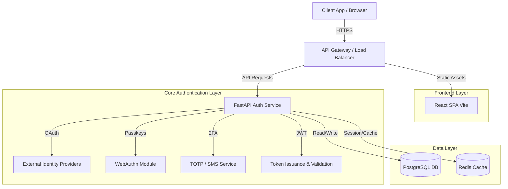

<div align="center">
  

  <h1>🛡️ Auth Service</h1>
  <p><i>Next-Generation Enterprise Authentication & Authorization Platform</i></p>

  <p>
    <a href="https://github.com/PashKa-tech/auth-service/actions"></a>
    <a href="https://github.com/PashKa-tech/auth-service/releases"></a>
    <a href="https://github.com/PashKa-tech/auth-service/blob/main/LICENSE"></a>
    <a href="https://fastapi.tiangolo.com/"></a>
    <a href="https://react.dev/"></a>
  </p>
</div>

<hr />

## ✨ Features

- **🔑 Passkeys (WebAuthn)**: Passwordless, phishing-resistant authentication using biometrics.
- **🌐 OAuth 2.0 & OIDC**: Seamless SSO integration with leading identity providers (Google, GitHub, Microsoft).
- **🛡️ 2FA / MFA**: Multi-factor authentication supporting TOTP and SMS.
- **🎫 JWT Management**: Secure stateless sessions with robust token rotation and revocation.
- **⚡ High Performance**: Built with asynchronous Python (FastAPI) handling thousands of reqs/sec.
- **🎨 Modern UI**: A blazing-fast, responsive dashboard built with React and Vite.

## 🛠️ Tech Stack

### Backend
- **Framework**: [FastAPI](https://fastapi.tiangolo.com/)
- **Database**: PostgreSQL with SQLAlchemy ORM
- **Cache**: Redis (Rate Limiting, Session Storage)

### Frontend
- **Framework**: [React](https://react.dev/)
- **Build Tool**: [Vite](https://vitejs.dev/)
- **Styling**: Tailwind CSS / Vanilla CSS

### DevOps
- **Containerization**: Docker & Docker Compose
- **CI/CD**: GitHub Actions

## 🏗️ Architecture



## 🚀 Setup Instructions

### Prerequisites
- [Docker](https://www.docker.com/get-started) and [Docker Compose](https://docs.docker.com/compose/)
- Git

### Quick Start

1. **Clone the repository**
   ```bash
   git clone https://github.com/PashKa-tech/auth-service.git
   cd auth-service
   ```

2. **Environment Configuration**
   Copy the example environment file and configure your secrets:
   ```bash
   cp .env.example .env
   ```

3. **Start the Platform**
   Deploy the entire stack (Frontend, Backend, Database, Cache) with a single command:
   ```bash
   docker-compose up -d --build
   ```

4. **Access the Services**
   - 🌐 **Frontend Dashboard**: [http://localhost:3000](http://localhost:3000)
   - 📖 **API Documentation (Swagger)**: [http://localhost:8000/docs](http://localhost:8000/docs)

## 📖 Documentation

For detailed guides, please refer to our [Wiki](https://github.com/PashKa-tech/auth-service/wiki).

## 🤝 Contributing

We welcome contributions! Please review our [Contribution Guidelines](CONTRIBUTING.md) before submitting a pull request.

## 📄 License

This project is licensed under the MIT License - see the [LICENSE](LICENSE) file for details.
