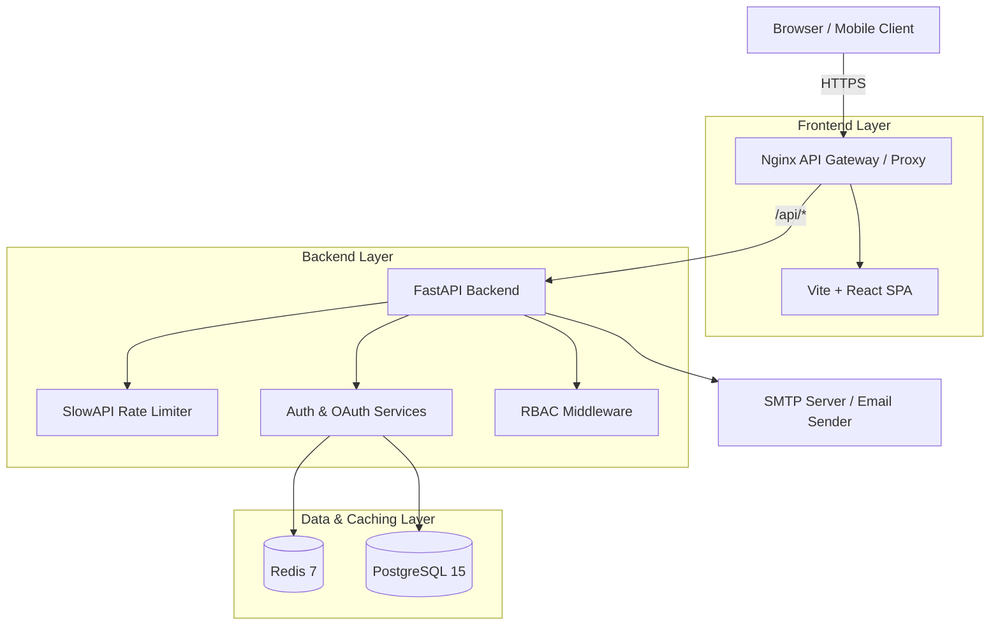

# 🛡️ Enterprise Auth Service
*🇺🇸 English version | [🇷🇺 Русская версия](README.ru.md)*


**Enterprise Auth Service** is a modern, highly scalable, and fully secure authentication and authorization system. This project provides a production-ready Identity Provider (IdP) supporting the latest security standards: WebAuthn (Passkeys), OAuth 2.0 (Social Logins), 2FA/MFA (TOTP), JWT-based session management, and a built-in admin dashboard.

---

## 📑 Table of Contents
1. [Key Features](#1-key-features)
2. [Service Architecture](#2-service-architecture)
3. [Technology Stack](#3-technology-stack)
4. [Installation Guide (Quick Start)](#4-installation-guide-quick-start)
5. [Project Structure](#5-project-structure)
6. [Detailed Module Descriptions](#6-detailed-module-descriptions)
7. [Deployment (Production)](#7-deployment-production)

---

## 1. Key Features

### 🔒 Security and Authentication
* **WebAuthn / Passkeys:** Passwordless login via biometrics (FaceID, TouchID, Windows Hello, YubiKey).
* **OAuth 2.0:** Instant login via Discord, Apple, Facebook, Twitter, Amazon, Google, GitHub.
* **Two-Factor Authentication (2FA/MFA):** Mandatory verification via Google Authenticator / Authy (TOTP codes).
* **JWT & Refresh Tokens:** High-performance session management. Refresh tokens are stored in secure HttpOnly cookies (XSS protection).
* **Email Verification & Password Reset:** Full account recovery flow via SMTP with temporary JWT tokens.
* **Rate Limiting & Anti-Bruteforce:** Built-in DDoS and password bruteforce protection based on SlowAPI.
* **RBAC (Role-Based Access Control):** Hierarchical role system (User, Moderator, Admin) and permission checking.

### 🎨 Premium Interface (UI/UX)
* **Glassmorphism Design:** Ultramodern interface with frosted glass effects and dynamic gradients.
* **Framer Motion:** Smooth appearance animations, page transitions, and hover effects.
* **Toast Notification System:** Global animated pop-ups for errors and success messages.

---

## 2. Service Architecture



1. **API Gateway (Nginx):** Serves React static files and proxies `/api/*` requests to the backend, solving CORS issues in production.
2. **FastAPI (Backend):** Core business logic. Processes requests asynchronously, generates tokens, and communicates with DB and Redis.
3. **Redis:** Stores temporary `state` keys for OAuth (CSRF protection) and challenge strings for WebAuthn.
4. **PostgreSQL:** Reliable storage for users, password hashes (Bcrypt), and sessions.

---

## 3. Technology Stack

### Backend
- **Python 3.12** + **FastAPI**: Incredibly fast modern framework.
- **SQLAlchemy (Async)** + **Alembic**: ORM for database management and migrations.
- **Pydantic V2**: Input data validation.
- **WebAuthn**: Biometric authorization library.
- **PyJWT & Passlib**: Hashing and tokens.
- **SlowAPI**: Rate limiting.

### Frontend
- **React 18** + **Vite**: Ultra-fast build.
- **TypeScript**: Strict typing across the entire codebase.
- **TailwindCSS** + **Framer Motion**: Styling and animations.
- **Recharts**: Interactive charts for the admin panel.
- **SimpleWebAuthn**: Direct communication with hardware keys from the browser.

---

## 4. Installation Guide (Quick Start)

You only need **Docker** and **Docker Compose** for local setup.

### Step 1: Clone and Configure
```bash
git clone https://github.com/PashKa-tech/auth-service.git
cd auth-service
```

### Step 2: Environment Variables
Copy the example config to your working environment:
```bash
cp backend/.env.example backend/.env
cp frontend/.env.local frontend/.env
```
In `backend/.env`, you can specify keys for OAuth (Discord, Apple, etc.) and an SMTP server for sending emails.

### Step 3: Launch via Makefile
If you have `make` installed, simply type:
```bash
make up
```
Alternatively, use Docker directly:
```bash
docker-compose up -d --build
```

### Step 4: Run Database Migrations
To create tables in a fresh database, run:
```bash
make migrate
# or: docker-compose exec backend alembic upgrade head
```

### Step 5: Usage
- **Frontend (UI):** Open `http://localhost` (or `http://localhost:3000` without Docker)
- **Backend API Docs:** Open `http://localhost:8000/docs` (Swagger UI)

---

## 5. Project Structure

```text
auth-service/
├── .github/workflows/    # CI/CD pipelines (Automated testing)
├── backend/              # FastAPI Application
│   ├── alembic/          # Database migrations
│   ├── src/
│   │   ├── api/          # Routes (Endpoints)
│   │   ├── core/         # RBAC, Exceptions, Security
│   │   ├── models/       # SQLAlchemy DB schemas
│   │   ├── repositories/ # Data access layer (CRUD)
│   │   ├── services/     # Business logic (Auth, Email, WebAuthn)
│   │   └── templates/    # Jinja2 HTML email templates
│   ├── Dockerfile        # Backend containerization
│   └── main.py           # Entry point, Middleware, SlowAPI
├── frontend/             # React SPA Application
│   ├── src/
│   │   ├── components/   # UI components (Toasts, Layout)
│   │   ├── pages/        # Screens (Login, Profile, Admin)
│   │   └── services/     # API Client (Axios)
│   ├── index.css         # Global styles (Glassmorphism)
│   ├── Dockerfile        # Frontend containerization (Multi-stage)
│   └── nginx.conf        # Web server configuration
├── docker-compose.yml    # Container orchestration
└── Makefile              # Handy commands for developers
```

---

## 6. Detailed Module Descriptions

### 🔑 Advanced OAuth 2.0
The OAuth module (in `services/oauth.py`) is built to easily add new providers. It supports:
- **PKCE & State Validation**: Prevents CSRF attacks and code interception. The `state` key is temporarily saved in Redis with a 5-minute TTL.
- **Dynamic Redirect URIs**: Routing automatically determines the base domain, ensuring callbacks always return to the correct address.

### 🛡️ WebAuthn (Passkeys)
The passwordless future is here. The flow is split into two stages:
1. `GET /begin`: The server generates a random cryptographic `challenge` and saves it in Redis.
2. The client-side `SimpleWebAuthn` signs the challenge with the device's private key (e.g., TouchID).
3. `POST /complete`: The server verifies the signature with the public key and issues a JWT token upon success.

### ✉️ Email Verification and Password Reset
Utilizes asynchronous `aiosmtplib` and HTML email rendering via `Jinja2`.
- A UUID token is generated upon registration and saved to the DB (`verification_tokens` table) with a 24-hour lifespan.
- The user receives a beautiful email. Clicking the link validates and deletes the token.
- Password resets work similarly, but with a 1-hour lifespan.

---

## 7. Deployment (Production)

To deploy on a production server (Ubuntu/Debian), follow these steps:

1. **Install Docker and Docker Compose.**
2. Clone the repository to your server.
3. Edit `backend/.env` and set production variables (real SMTP, `DOMAIN=yourdomain.com`, strong DB passwords).
4. Configure a **Reverse Proxy** (Nginx/Traefik) on top of your server to handle SSL/HTTPS. *OAuth and WebAuthn require HTTPS in production!*
5. Start the project:
   ```bash
   docker-compose -f docker-compose.yml up -d --build
   ```
6. Run migrations:
   ```bash
   docker-compose exec backend alembic upgrade head
   ```

🎉 **Congratulations! Your Enterprise Auth Service is running and ready to handle thousands of requests per second.**
