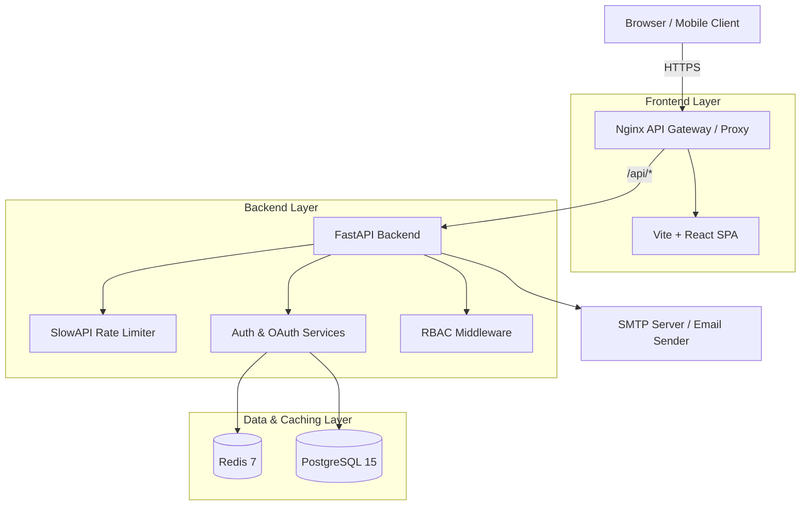

# 🛡️ Enterprise Auth Service
*🇷🇺 Русская версия | [🇺🇸 English version](README.md)*


**Enterprise Auth Service** — это современная, высоконагруженная и полностью защищенная система аутентификации и авторизации, построенная на принципах Чистой Архитектуры. Проект предоставляет готовый Identity Provider (IdP) с поддержкой самых современных стандартов безопасности: WebAuthn (Passkeys), OAuth 2.0 (социальные сети), 2FA/MFA (TOTP), управление сессиями на базе JWT, поддержкой Multi-Tenancy для B2B SaaS и встроенной панелью администратора.

---

## 📑 Оглавление
1. [Почему эта папка? (CI/CD)](#1-почему-эта-папка-cicd)
2. [Ключевые возможности](#2-ключевые-возможности)
3. [Архитектура сервиса](#3-архитектура-сервиса)
4. [Технологический стек](#4-технологический-стек)
5. [Гайд по установке (Быстрый старт)](#5-гайд-по-установке-быстрый-старт)
6. [Структура проекта и Чистая Архитектура](#6-структура-проекта-и-чистая-архитектура)
7. [Детальное описание модулей](#7-детальное-описание-модулей)
8. [Развертывание (Production)](#8-развертывание-production)

---

## 1. Почему эта папка? (CI/CD)
Папка `.github/workflows` — это стандартная директория для настройки **GitHub Actions**. В ней лежит файл конфигурации, который заставляет GitHub автоматически проверять ваш код. 
Теперь каждый раз, когда вы делаете `git push`, серверы GitHub будут:
- Автоматически запускать тесты бэкенда (`pytest`).
- Автоматически проверять компиляцию фронтенда (`npm run build`).
Это гарантия того, что в главную ветку (main) никогда не попадет сломанный код. Это абсолютный стандарт для любого Enterprise проекта.

---

## 2. Ключевые возможности

### 🔒 Безопасность и Аутентификация
* **WebAuthn / Passkeys:** Беспарольный вход через биометрию (FaceID, TouchID, Windows Hello, YubiKey).
* **OAuth 2.0:** Мгновенный вход через Discord, Apple, Facebook, Twitter, Amazon, Google, GitHub.
* **Двухфакторная аутентификация (2FA/MFA):** Обязательное подтверждение через Google Authenticator / Authy (генерация TOTP-кодов).
* **Продвинутая криптография:** Пароли математически защищены самым современным алгоритмом **Argon2** (с защитой от брутфорса на GPU).
* **JWT & Refresh Tokens:** Высокопроизводительное управление сессиями. Refresh токены хранятся в защищенных HttpOnly куках (защита от XSS).
* **Сброс и верификация Email:** Полноценный флоу восстановления доступа через SMTP с временными JWT токенами.
* **Rate Limiting & Anti-Bruteforce:** Встроенная защита от DDoS и перебора паролей на основе библиотеки SlowAPI.
* **RBAC (Role-Based Access Control):** Иерархическая система ролей (User, Moderator, Admin) и строгая проверка прав (PermissionChecker).

### 🏢 B2B Multi-Tenancy (Мультитенантность)
* **Изоляция данных:** Архитектура фундаментально поддерживает разделение данных между клиентами (тенантами). Любой репозиторий наследуется от `TenantScopedRepository`.
* **Разрешение контекста:** API автоматически определяет правильный `tenant_id` контекст через API Ключи, JWT-токены или HTTP Заголовки.

### 🎨 Premium Интерфейс (UI/UX)
* **Glassmorphism Design:** Ультрасовременный интерфейс с эффектом матового стекла и живыми градиентами.
* **Framer Motion:** Плавные анимации появления, переходов между страницами и интерактивные ховер-эффекты.
* **Система Toast уведомлений:** Глобальные анимированные всплывающие окна для ошибок и успехов.

---

## 3. Архитектура сервиса



1. **API Gateway (Nginx):** Раздает статику React и проксирует запросы `/api/*` на бэкенд, полностью решая проблемы с CORS в production.
2. **FastAPI (Backend):** Ядро бизнес-логики. Асинхронно обрабатывает запросы, генерирует токены, общается с БД и Redis.
3. **Redis:** Хранит временные ключи `state` для OAuth (предотвращение CSRF атак) и challenge-строки для WebAuthn.
4. **PostgreSQL:** Надежное реляционное хранилище пользователей, хэшей паролей (Argon2) и пользовательских сессий.

---

## 4. Технологический стек

### Backend
- **Python 3.12** + **FastAPI**: Невероятно быстрый современный асинхронный фреймворк.
- **SQLAlchemy (Async)** + **Alembic**: Продвинутая ORM для управления базой данных и миграциями.
- **Pydantic V2**: Сверхбыстрая валидация входных данных.
- **WebAuthn**: Полноценная библиотека для биометрической авторизации.
- **PyJWT & Argon2-cffi**: Enterprise-хеширование и токены без состояний.
- **SlowAPI**: Ограничение количества запросов (троттлинг).

### Frontend
- **React 18** + **Vite**: Сверхбыстрая сборка и Hot-Module Replacement (HMR).
- **TypeScript**: Строгая типизация всего кода для исключения ошибок во время выполнения.
- **TailwindCSS** + **Framer Motion**: Быстрая стилизация и красивые анимации на базе физики.
- **Recharts**: Интерактивные графики для панели администратора.
- **SimpleWebAuthn**: Прямое взаимодействие с аппаратными ключами напрямую из браузера.

---

## 5. Гайд по установке (Быстрый старт)

Для локального запуска вам понадобится только **Docker** и **Docker Compose**. Никакая ручная настройка окружения не требуется.

### Шаг 1: Клонирование и настройка
```bash
git clone https://github.com/PashKa-tech/auth-service.git
cd auth-service
```

### Шаг 2: Переменные окружения
Скопируйте пример конфигурации в ваше рабочее окружение:
```bash
cp backend/.env.example backend/.env
cp frontend/.env.local frontend/.env
```
В файле `backend/.env` вы можете указать ключи для провайдеров OAuth (Discord, Apple, Google и т.д.) и настроить ваш SMTP-сервер для отправки писем верификации.

### Шаг 3: Запуск через Makefile
Если у вас установлена утилита `make`, просто введите:
```bash
make up
```
Либо используйте Docker Compose напрямую:
```bash
docker-compose up -d --build
```

### Шаг 4: Накат миграций БД
Чтобы создать таблицы в вашей свежей базе данных, выполните:
```bash
make migrate
# или: docker-compose exec backend alembic upgrade head
```

### Шаг 5: Использование
Ваш Auth Service теперь запущен через Traefik! 
- **Frontend Dashboard**: `http://localhost` или `http://localhost:8080`
- **Backend API Docs**: `http://api.localhost` или `http://localhost:8000/docs` (Интерактивный Swagger UI)
- **Grafana Мониторинг**: `http://grafana.localhost` (логин/пароль: admin/admin)

---

## 6. Структура проекта и Чистая Архитектура

Этот проект строго следует паттерну **Repository/Service** для изоляции бизнес-логики от работы с данными.

```text
auth-service/
├── .github/workflows/    # CI/CD pipelines (Автоматические тесты и Линтинг)
├── backend/              # FastAPI Application
│   ├── alembic/          # Миграции базы данных
│   ├── src/
│   │   ├── api/          # Delivery Layer: Роуты и Эндпоинты
│   │   ├── core/         # Core config: RBAC, Исключения, Безопасность, Контекст
│   │   ├── models/       # Data Layer: SQLAlchemy схемы БД
│   │   ├── repositories/ # Persistence Layer: Слой доступа к данным (CRUD)
│   │   ├── services/     # Business Layer: Бизнес-логика (Auth, Email, WebAuthn)
│   │   └── templates/    # Presentation: Jinja2 HTML шаблоны писем
│   ├── Dockerfile        # Контейнеризация бэкенда
│   └── main.py           # Фабрика приложения, Middleware, SlowAPI
├── frontend/             # React SPA Application
│   ├── src/
│   │   ├── components/   # Переиспользуемые UI компоненты (Toasts, Формы)
│   │   ├── pages/        # Экраны (Login, Profile, Admin)
│   │   └── services/     # Клиент внешнего API (обертки Axios)
│   ├── index.css         # Глобальные стили (переменные Tailwind + Glassmorphism)
│   ├── Dockerfile        # Контейнеризация фронтенда (Multi-stage сборка)
│   └── nginx.conf        # Настройка продакшен веб-сервера
├── docker-compose.yml    # Оркестрация контейнеров
└── Makefile              # Удобные команды для разработчиков
```

---

## 7. Детальное описание модулей

### 🔑 Продвинутый OAuth 2.0
Модуль OAuth (в `services/oauth.py`) построен с прицелом на легкое расширение. Поддерживается:
- **PKCE & State Validation**: Предотвращает CSRF атаки и перехват кода. Ключ `state` надежно сохраняется в Redis.
- **Dynamic Redirect URIs**: Роутинг автоматически определяет базовый домен, гарантируя, что коллбеки всегда вернутся на правильный origin.

### 🛡️ WebAuthn (Passkeys)
Беспарольное будущее здесь. Процесс разбит на сверхнадежный двухэтапный флоу:
1. **Challenge:** `GET /begin` — Сервер генерирует случайный криптографический `challenge` и кэширует его в Redis.
2. **Attestation/Assertion:** Клиентский `SimpleWebAuthn` подписывает challenge приватным ключом устройства (например, TouchID).
3. **Verification:** `POST /complete` — Сервер проверяет подпись с помощью публичного ключа и, в случае успеха, выдает JWT токен.

### ✉️ Email-верификация и сброс паролей
Используется асинхронный `aiosmtplib` и рендеринг HTML-писем через `Jinja2`.
- При регистрации безопасно генерируется UUID-токен, который записывается в БД (таблица `verification_tokens`) со строгим окном экспирации.
- Пользователь получает красивое брендированное HTML-письмо. При клике на ссылку токен валидируется и надежно удаляется из базы.

---

## 8. Развертывание (Production)

Для развертывания на боевом сервере (Ubuntu/Debian) следуйте этим best practices:

1. **Установите Docker и Docker Compose.**
2. Склонируйте репозиторий на сервер.
3. Отредактируйте `backend/.env` и безопасно укажите боевые переменные:
   - Подключите реальный SMTP.
   - Укажите `DOMAIN=yourdomain.com`.
   - Используйте криптографически сильные пароли для БД.
   - Замените дефолтные `TOTP_ENCRYPTION_KEY` и `JWT_SECRET_KEY` на сгенерированные 32-байтные секреты.
4. Настройте **Reverse Proxy** (Nginx/Traefik/Caddy) поверх вашего сервера для обработки SSL/HTTPS. *OAuth и WebAuthn фундаментально требуют защищенного HTTPS окружения для работы!*
5. Запустите проект:
   ```bash
   docker-compose -f docker-compose.yml up -d --build
   ```
6. Выполните миграции:
   ```bash
   docker-compose exec backend alembic upgrade head
   ```

🎉 **Поздравляем! Ваш Enterprise Auth Service запущен и готов к обработке тысяч параллельных запросов.**
