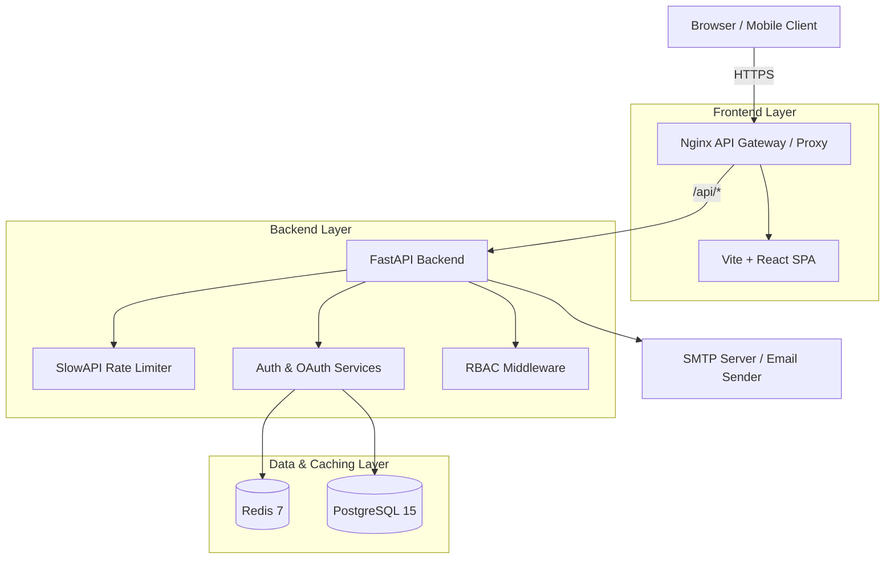

# 🛡️ Enterprise Auth Service
*🇷🇺 Русская версия | [🇺🇸 English version](README.md)*


**Enterprise Auth Service** — это современная, высоконагруженная и полностью защищенная система аутентификации и авторизации. Проект предоставляет готовый Identity Provider (IdP) с поддержкой самых современных стандартов безопасности: WebAuthn (Passkeys), OAuth 2.0 (социальные сети), 2FA/MFA (TOTP), управление сессиями на базе JWT и встроенную панель администратора.

---

## 📑 Оглавление
1. [Почему эта папка? (CI/CD)](#1-почему-эта-папка-cicd)
2. [Ключевые возможности](#2-ключевые-возможности)
3. [Архитектура сервиса](#3-архитектура-сервиса)
4. [Технологический стек](#4-технологический-стек)
5. [Гайд по установке (Быстрый старт)](#5-гайд-по-установке-быстрый-старт)
6. [Структура проекта](#6-структура-проекта)
7. [Детальное описание модулей](#7-детальное-описание-модулей)
8. [Развертывание (Production)](#8-развертывание-production)

---

## 1. Почему эта папка? (CI/CD)
Папка `.github/workflows` — это стандартная директория для настройки **GitHub Actions**. В ней лежит файл конфигурации, который заставляет GitHub автоматически проверять ваш код. 
Теперь каждый раз, когда вы делаете `git push`, серверы GitHub будут:
- Автоматически запускать тесты бэкенда (`pytest`).
- Автоматически проверять компиляцию фронтенда (`npm run build`).
Это гарантия того, что в главную ветку (main) никогда не попадет сломанный код. Это абсолютный стандарт для любого Enterprise проекта.

---

## 2. Ключевые возможности

### 🔒 Безопасность и Аутентификация
* **WebAuthn / Passkeys:** Беспарольный вход через биометрию (FaceID, TouchID, Windows Hello, YubiKey).
* **OAuth 2.0:** Мгновенный вход через Discord, Apple, Facebook, Twitter, Amazon, Google, GitHub.
* **Двухфакторная аутентификация (2FA/MFA):** Обязательное подтверждение через Google Authenticator / Authy (генерация TOTP-кодов).
* **JWT & Refresh Tokens:** Высокопроизводительное управление сессиями. Refresh токены хранятся в защищенных HttpOnly куках (защита от XSS).
* **Сброс и верификация Email:** Полноценный флоу восстановления доступа через SMTP с временными JWT токенами.
* **Rate Limiting & Anti-Bruteforce:** Встроенная защита от DDoS и перебора паролей на основе библиотеки SlowAPI.
* **RBAC (Role-Based Access Control):** Иерархическая система ролей (User, Moderator, Admin) и проверка прав (PermissionChecker).

### 🎨 Premium Интерфейс (UI/UX)
* **Glassmorphism Design:** Ультрасовременный интерфейс с эффектом матового стекла и живыми градиентами.
* **Framer Motion:** Плавные анимации появления, переходов между страницами и ховер-эффекты.
* **Система Toast уведомлений:** Глобальные анимированные всплывающие окна для ошибок и успехов.

---

## 3. Архитектура сервиса



1. **API Gateway (Nginx):** Раздает статику React и проксирует запросы `/api/*` на бэкенд, решая проблемы с CORS в production.
2. **FastAPI (Backend):** Ядро бизнес-логики. Асинхронно обрабатывает запросы, генерирует токены, общается с БД и Redis.
3. **Redis:** Хранит временные ключи `state` для OAuth (предотвращение CSRF атак) и challenge-строки для WebAuthn.
4. **PostgreSQL:** Надежное хранение пользователей, хэшей паролей (Bcrypt) и сессий.

---

## 4. Технологический стек

### Backend
- **Python 3.12** + **FastAPI**: Невероятно быстрый современный фреймворк.
- **SQLAlchemy (Async)** + **Alembic**: ORM для управления базой данных и миграциями.
- **Pydantic V2**: Валидация входных данных.
- **WebAuthn**: Библиотека для биометрической авторизации.
- **PyJWT & Passlib**: Хеширование и токены.
- **SlowAPI**: Ограничение количества запросов.

### Frontend
- **React 18** + **Vite**: Сверхбыстрая сборка.
- **TypeScript**: Строгая типизация всего кода.
- **TailwindCSS** + **Framer Motion**: Стилизация и анимации.
- **Recharts**: Интерактивные графики для панели администратора.
- **SimpleWebAuthn**: Общение с аппаратными ключами напрямую из браузера.

---

## 5. Гайд по установке (Быстрый старт)

Для локального запуска вам понадобится только **Docker** и **Docker Compose**.

### Шаг 1: Клонирование и настройка
```bash
git clone https://github.com/PashKa-tech/auth-service.git
cd auth-service
```

### Шаг 2: Переменные окружения
Скопируйте пример конфига в рабочий:
```bash
cp backend/.env.example backend/.env
cp frontend/.env.local frontend/.env
```
В файле `backend/.env` вы можете указать ключи для OAuth (Discord, Apple и т.д.) и SMTP-сервер для отправки писем.

### Шаг 3: Запуск через Makefile
Если у вас есть утилита `make`, просто введите:
```bash
make up
```
Либо используйте Docker напрямую:
```bash
docker-compose up -d --build
```

### Шаг 4: Накат миграций БД
Чтобы создать таблицы в свежей базе данных, выполните:
```bash
make migrate
# или: docker-compose exec backend alembic upgrade head
```

### Шаг 5: Использование
- **Frontend (UI):** Откройте `http://localhost` (или `http://localhost:3000` без Docker)
- **Backend API Docs:** Откройте `http://localhost:8000/docs` (Swagger UI)

---

## 6. Структура проекта

```text
auth-service/
├── .github/workflows/    # CI/CD pipelines (Автоматическое тестирование)
├── backend/              # FastAPI Application
│   ├── alembic/          # Миграции базы данных
│   ├── src/
│   │   ├── api/          # Роуты (Endpoints)
│   │   ├── core/         # RBAC, Exceptions, Security
│   │   ├── models/       # SQLAlchemy схемы БД
│   │   ├── repositories/ # Слой доступа к данным (CRUD)
│   │   ├── services/     # Бизнес-логика (Auth, Email, WebAuthn)
│   │   └── templates/    # Jinja2 HTML шаблоны писем
│   ├── Dockerfile        # Контейнеризация бэкенда
│   └── main.py           # Точка входа, Middleware, SlowAPI
├── frontend/             # React SPA Application
│   ├── src/
│   │   ├── components/   # UI компоненты (Toasts, Layout)
│   │   ├── pages/        # Экраны (Login, Profile, Admin)
│   │   └── services/     # API Client (Axios)
│   ├── index.css         # Глобальные стили (Glassmorphism)
│   ├── Dockerfile        # Контейнеризация фронтенда (Multi-stage)
│   └── nginx.conf        # Настройка веб-сервера
├── docker-compose.yml    # Оркестрация контейнеров
└── Makefile              # Удобные команды для разработчика
```

---

## 7. Детальное описание модулей

### 🔑 Продвинутый OAuth 2.0
Модуль OAuth (в `services/oauth.py`) построен так, чтобы легко добавлять новых провайдеров. Поддерживается:
- **PKCE & State Validation**: Предотвращает CSRF атаки и перехват кода. Ключ `state` временно сохраняется в Redis с TTL в 5 минут.
- **Dynamic Redirect URIs**: Роутинг автоматически определяет базовый домен, гарантируя, что коллбеки всегда вернутся на правильный адрес (например, `api.mydomain.com/api/v1/auth/oauth/discord/callback`).

### 🛡️ WebAuthn (Passkeys)
Беспарольное будущее здесь. Флоу разбит на два этапа:
1. `GET /begin`: Сервер генерирует случайный криптографический `challenge` и сохраняет его в Redis.
2. Клиентский `SimpleWebAuthn` подписывает challenge приватным ключом устройства (TouchID).
3. `POST /complete`: Сервер проверяет подпись публичным ключом и, в случае успеха, выдает JWT токен.

### ✉️ Email-верификация и сброс паролей
Используется асинхронный `aiosmtplib` и рендеринг HTML-писем через `Jinja2`.
- При регистрации генерируется UUID-токен, записывается в БД (таблица `verification_tokens`) со сроком жизни 24 часа.
- Пользователь получает красивое письмо. При переходе по ссылке токен валидируется и удаляется.
- Сброс пароля работает по аналогичной схеме, но с 1-часовым сроком жизни.

---

## 8. Развертывание (Production)

Для развертывания на боевом сервере (Ubuntu/Debian) выполните следующие шаги:

1. **Установите Docker и Docker Compose.**
2. Склонируйте репозиторий на сервер.
3. Отредактируйте `backend/.env` и укажите боевые переменные (настоящий SMTP, `DOMAIN=yourdomain.com`, надежные пароли для БД).
4. Настройте **Reverse Proxy** (Nginx/Traefik) поверх вашего сервера для обработки SSL/HTTPS. *OAuth и WebAuthn требуют обязательного HTTPS в production!*
5. Запустите проект:
   ```bash
   docker-compose -f docker-compose.yml up -d --build
   ```
6. Выполните миграции:
   ```bash
   docker-compose exec backend alembic upgrade head
   ```

🎉 **Поздравляем! Ваш Enterprise Auth Service запущен и готов к обработке тысяч запросов в секунду.**
